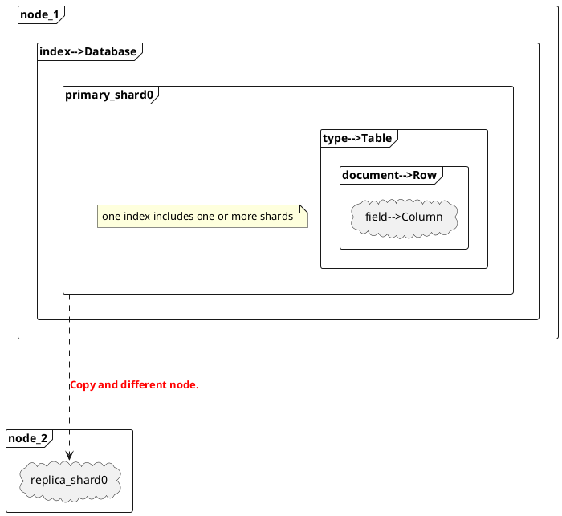

> Stage review  
> - _Distributed Document Store_
> - **文檔數據存儲系統**
> - 操作JSON文檔類型數據
>   - NOSQL存儲系統

<!--more-->

# Elasticsearch core structure
------

IMG download => [ES core structure](/images/elasticsearch/020_stage_review.png)

