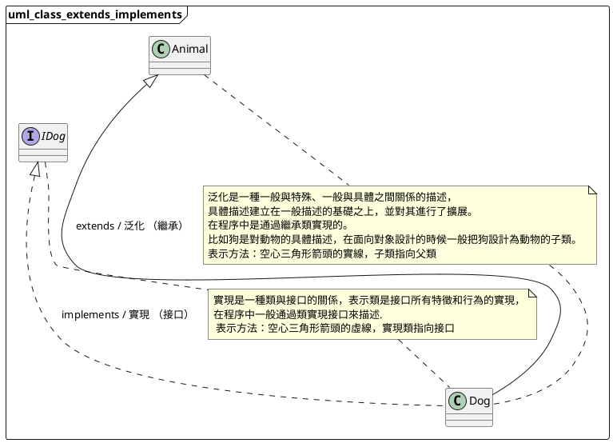
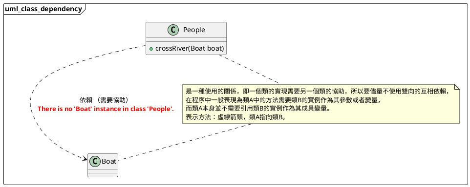
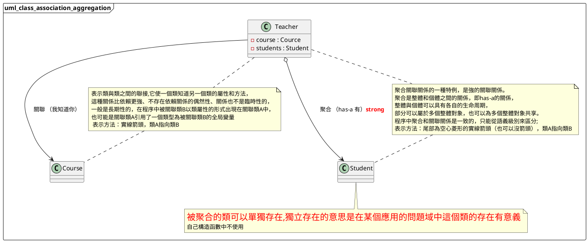
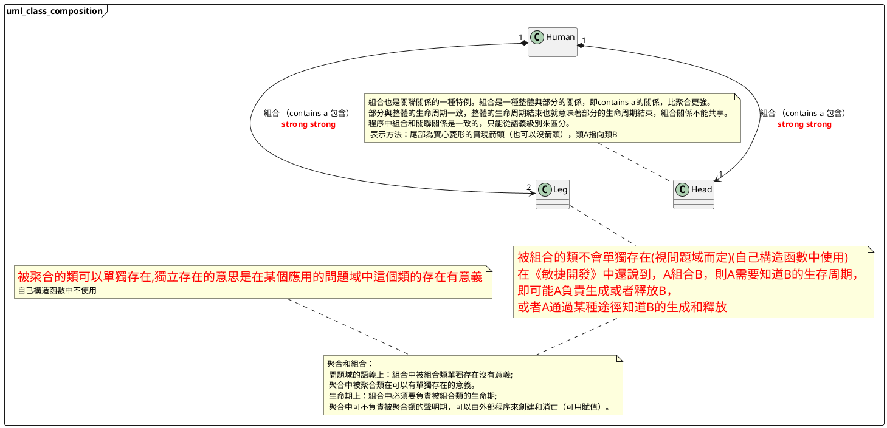

> - Unified Modeling Language

<!--more-->

# UML class diagram
------

IMG download => [uml_class_extends_implements](/images/elasticsearch/021_uml_class_01.png)

IMG download => [uml_class_dependency](/images/elasticsearch/021_uml_class_02.png)

IMG download => [uml_class_association_aggregation](/images/elasticsearch/021_uml_class_03.png)

IMG download => [uml_class_composition](/images/elasticsearch/021_uml_class_04.png)

