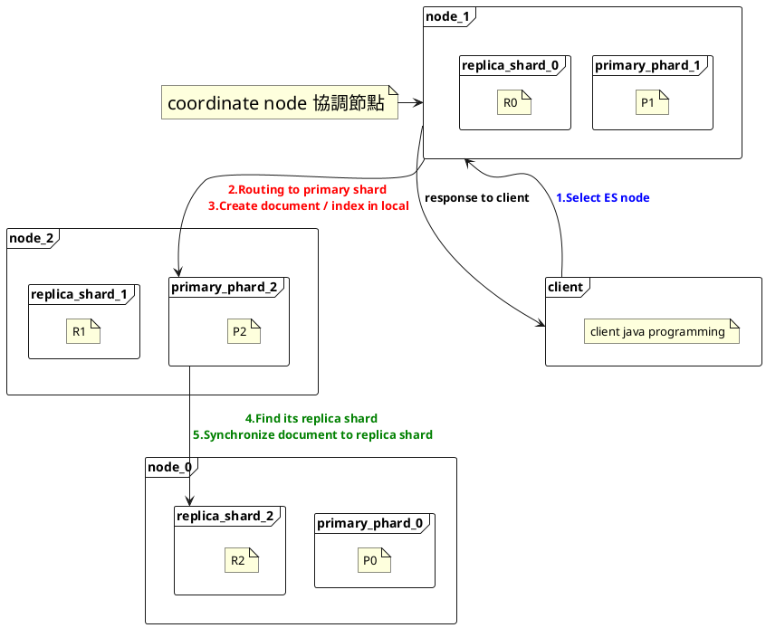

> Document Routing principle 

<!--more-->

# Document Routing
------
- When client creates document, ES determines which shard of index the document is in. 
- Routing algorithm 
    - **```shard = hash ( routing ) % number_of_primary_shards```**
        - routing = routing id , ex : document_id ( default num , _you can be manually specified_. )
        - hash ( routing) = hash ( document_id ) : hash code
        - mod ( num of primary shards ) -> result is always from **zero** to [ **number_of_primary_shards - 1** ]
        - routing algorithm is base on primary shard.
        
# Document 'CUD' flow 
------
- 'CUD' operating locate on primary shard.



